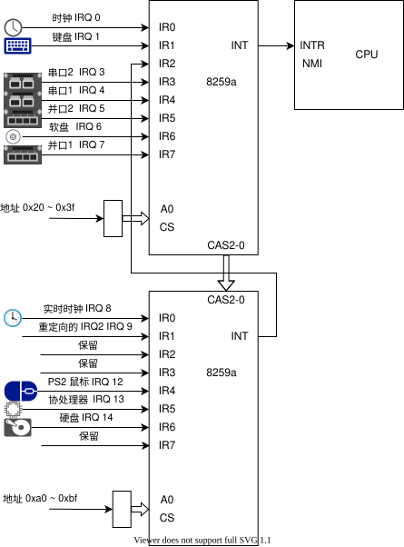
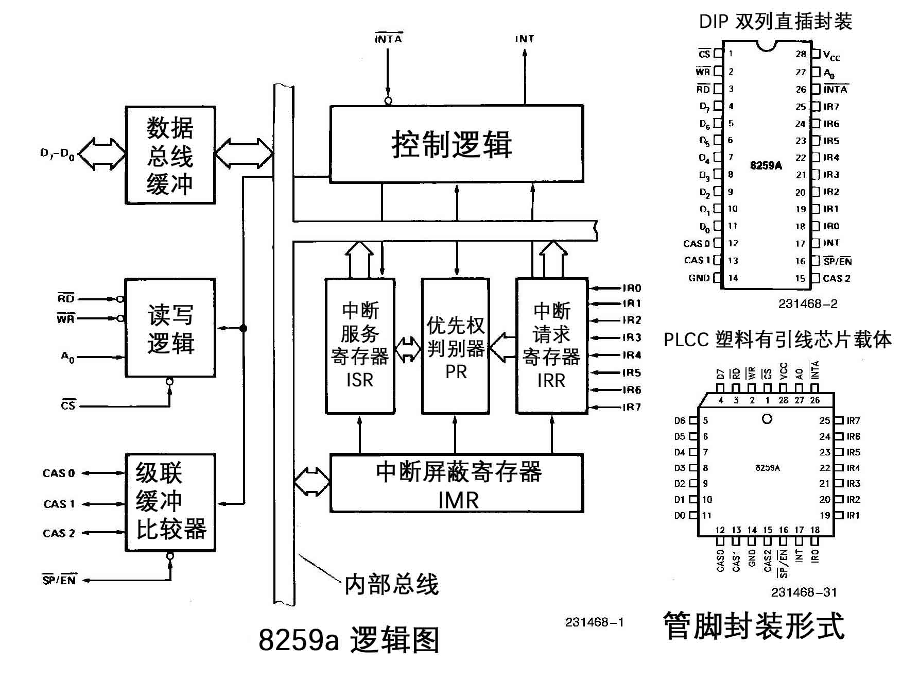

# 外中断原理

## 中断机制

PIC Programmable Interrupt Controller 可编程中断控制器

在使用 80x86 组成的 PC 机中，采用了两片 8259a 可编程中断控制芯片。每片可以管理 8 个中断源。通过多片的级联方式，能构成最多管理 64 个中断向量的系统。在 PC/AT 系列兼容机中，使用了两片 8259a 芯片，共可管理 15 个中断向量。其级连示意图下图所示。其中从芯片的 INT 引脚连接到主芯片的 IR2 引脚上。主 8259a 芯片的端口基地址是 0x20，从芯片是 0xa0；



可屏蔽中断是通过 INTR 信号线进入 CPU，一般可独立运行的外部设备，如打印机、声卡等，其发出的中断都是可屏蔽中断，都共享这一根 INTR 信号线通知 CPU。中断控制器 8259a 就是用来作中断仲裁的；

## 8259a 原理



- INT: 8259A 选出优先级最高的中断请求后，发信号通知 CPU；
- INTA: INT Acknowledge，中断响应信号，位于 8259A 中的 INTA 接收来自 CPU 的 INTA 接口的中断响应信号；
    CPU 向该接口输出两个低电平响应：
    第一个INTA脉冲‌：CPU响应中断请求后，通过INTA告知8259A中断已被接收，随后8259A将最高优先级的中断请求存入内部服务寄存器（ISR）。表示该中断正在被处理
    第二个INTA脉冲：8259A将中断类型码发送给CPU，CPU据此跳转至对应的中断服务程序。8259a将IR0~IR7收到的中断类型号发送到D0~D7

- IMR: Interrupt Mask Register，中断屏蔽寄存器，宽度是 8 位，用来屏蔽某个外设的中断；
- IRR: Interrupt Request Register，中断请求寄存器，宽度是 8 位。它的作用是接受经过 IMR 寄存器过滤后的中断信号并锁存，此寄存器中全是等待处理的中断；
- PR: Priority Resolver，优先级仲裁器，当有多个中断同时发生，或当有新的中断请求进来时，将它与当前正在处理的中断进行比较，找出优先级更高的中断；
- ISR: In-Service Register，中断服务寄存器，宽度是 8 位，当某个中断正在被处理时，保存在此寄存器中；

以上介绍的寄存器都是 8 位，这是有意这样做的，其原因是 8259A 共 8 个 IRQ 接口，可以用 8 位寄存器中的每一位代表 8259A 的每个 IRQ 接口，类似于接口的位图，这样在后续的操作中，操作寄存器中的位便表示处理来自对应的 IRQ 接口的中断信号。


## **中断启动流程**

1. 外部设备触发中断；
2. IMR检查是否被屏蔽；
3. 发送到IRR等待处理；
4. PR 获取最高优先级的中断，触发INT信号；
5. CPU 响应INTR后 设置ISR中断位表示正要处理该中断；
6. CPU 再次响应INTR 发送ISR中优先级最高的中断号到CPU；

7. 清除ISR中的中断标志：
    - 如果设置了EOI(End of interrupt)为自动模式， ISR中的中断位会被清理
    - 否知中断处理程序结束前 CPU 必须向 8259A 发送 EOI；


## 代码实现

```c
#define PIC_M_CTRL 0x20 // 主片的控制端口
#define PIC_M_DATA 0x21 // 主片的数据端口
#define PIC_S_CTRL 0xa0 // 从片的控制端口
#define PIC_S_DATA 0xa1 // 从片的数据端口
#define PIC_EOI 0x20    // 通知中断控制器中断结束

// 初始化外中断芯片
// ICW(Initialization Command Word 初始化命令字)
// 初始化是发送ICW命令，一共有四条ICW1-ICW4,依次发送。
outb(PIC_M_CTRL, 0b00010001); // ICW1: 边沿触发, 级联 8259, 需要ICW4.
outb(PIC_M_DATA, 0x20);       // ICW2: 起始中断向量号 0x20
outb(PIC_M_DATA, 0b00000100); // ICW3: IR2接从片.
outb(PIC_M_DATA, 0b00000101); // ICW4: 主片 8086模式, 正常EOI

outb(PIC_S_CTRL, 0b00010001); // ICW1: 边沿触发, 级联 8259, 需要ICW4.
outb(PIC_S_DATA, 0x28);       // ICW2: 起始中断向量号 0x28
outb(PIC_S_DATA, 2);          // ICW3: 设置从片连接到主片的 IR2 引脚
outb(PIC_S_DATA, 0b00000001); // ICW4: 从片 8086模式, 正常EOI

outb(PIC_M_DATA, 0b11111110); // 关闭所有中断
outb(PIC_S_DATA, 0b11111111); // 关闭所有中断

// 发送EOI的方法
outb(PIC_M_CTRL, PIC_EOI);
```

- ICW1

bit  |   0    |   1
-----|--------|--------
bit0 | 不需要  | 需要ICW4
bit1 | 级联    | 单片
bit3 | 边沿触发 | 电平触发

- ICW2 中断码 需要三bit对齐

- ICW3 标志主片/从片
    - 对于主片来说，看IR0-IR7哪个上面有从片哪位就置1
    - 对于从片来说，比如从片连接到主片的IR3那从片标识符就应该设置为011. IR4 就设置100

- ICW4 方式控制初始化命令字

bit  |   0         |   1
-----|-------------|--------
bit0 | 8080/80805  | 8086/8088
bit1 | 非主动EIO    | 主动EIO
bit2 | 从片         | 主片
bit3 | 非缓冲       | 缓冲
bit4 | 非特殊全嵌套  | 特殊全嵌套

- 非特殊全嵌套：不设置优先级方式时默认是这种方式，在这种情况下，允许高级别中断打断低级别中断，等高级别中断执行完再回来执行低级别中断，实现中断的嵌套。注意不允许，同级别和低级别中断打断。IR0-IR7优先级依次降低

- 特殊全嵌套：和上面不同的是，允许同级别中断和高级别中断打断，不允许低级别中断打断。

    


