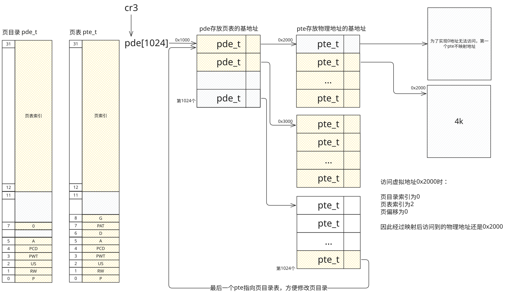

# 内存管理

## 内存管理机制分类

- 分段：
    - 内存描述符
    - 平坦模型：只分一个段，也就是不分段
- 分页：4KB

## 二级页表原理

4G 内存需要 1M 个 4K 页才能全部表示出来，如果每个程序都要1M页表，那么内存就不过用了。因此将页表拆分为页目录和页表：

cr3 存放页目录基地址 -> 页目录基地址存放页表基地址 -> 页表中查询到真实的物理地址

 31 ~ 22 | 21 ~ 12 | 11 ~ 0
 --------|---------|--------
 页目录   | 页表     | 页内偏移
 1024 个  | 1024个  | 4K

例子：

```c
// 指定内核页目录索引，之后会存放到 cr3 寄存器里
#define KERNEL_PAGE_DIR 0x1000

// 内核页表索引, 表示我们使用的页表
static uint32_t KERNEL_PAGE_TABLE[] = {
    0x2000, // 每个页表的起始地址，可以存放 1024 个页
    0x3000,
};

// 表示有两个页表，每个页表存放1024个页，总共可以存放 1024 * 4096 * 2 = 8M 的内存
#define KERNEL_MEMORY_SIZE (0x100000 * sizeof(KERNEL_PAGE_TABLE))
```

切换进程的时候需要切换cr3寄存器中的值即可


## 代码实现

```c
typedef struct page_entry_t {
    uint8_t present : 1;  // 在内存中
    uint8_t write : 1;    // 0 只读 1 可读可写
    uint8_t user : 1;     // 1 所有人 0 超级用户 DPL < 3
    uint8_t pwt : 1;      // page write through 1 直写模式，0 回写模式
    uint8_t pcd : 1;      // page cache disable 禁止该页缓冲
    uint8_t accessed : 1; // 被访问过，用于统计使用频率
    uint8_t dirty : 1;    // 脏页，表示该页缓冲被写过
    uint8_t pat : 1;      // page attribute table 页大小 4K/4M
    uint8_t global : 1;   // 全局，所有进程都用到了，该页不刷新缓冲
    uint8_t ignored : 3;  // 该安排的都安排了，送给操作系统吧
    uint32_t index : 20;  // 页索引(物理地址 >> 12) / 页目录索引（页物理地址 >> 12）
} _packed page_entry_t;
```

准备好页目录表及页表。
将页表地址写入控制寄存器 cr3。
寄存器 cr0 PG 位置 1。

注意：映射完成后，低端 1M 的内存要映射的原来的位置，因为内核放在那里，映射完成之后就可以继续执行了。

我们先映射8M物理内存到虚拟内存，只需要使用两个pde：




### 虚拟地址映射到物理地址的方法

1. 通过虚拟地址的 bit 31 ~ 22 确定页目录项；
2. 通过虚拟地址的 bit 21 ~ 12 确定页表项；
3. 将物理地址 >> 12 写到页表项里；

